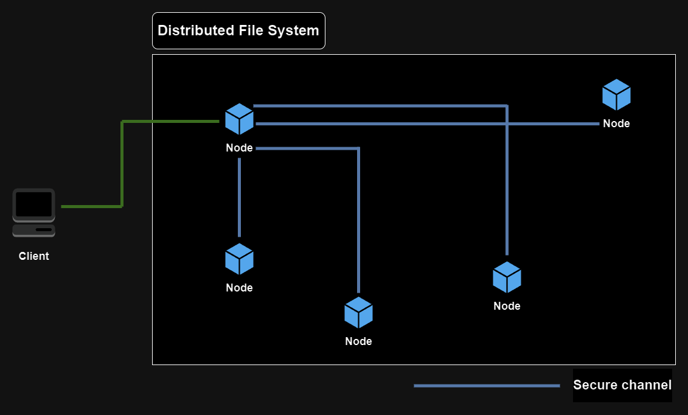

# Distributed File System

This project implements a Go-based peer-to-peer (P2P) distributed file system that allows nodes to communicate, transfer, store, and retrieve files over a TCP network. The system utilizes various encoding, encryption, and transport mechanisms to ensure efficient and secure file transfers. **Here's a high-level diagram of Distributed File System:**


## Features

- **Decentralization**: Operates without a central server, allowing nodes to directly communicate and share files.
- **P2P Communication**: Nodes communicate over TCP connections using custom protocols.
- **File Storage and Retrieval**: Supports storing and retrieving files across multiple nodes in the network.
- **Encryption and Decryption**: Utilizes AES encryption to securely transmit files over the network.
- **Custom Message Encoding**: Implements a custom encoding and decoding mechanism to handle different message types.
- **Concurrency**: Supports multiple simultaneous connections, enabling efficient data transfer between nodes.
- **Scalability**: Easily accommodates additional nodes, providing a scalable solution for distributed file storage and sharing.
- **Fault Tolerance**: Maintains functionality even when some nodes go offline, ensuring reliable file sharing.

## Table of Contents

1. [Installation](#installation)
2. [Usage](#usage)
3. [Code Overview](#code-overview)
   - [Encoding](#encoding)
   - [Handshake](#handshake)
   - [Messages](#messages)
   - [TCP Transport](#tcp-transport)
   - [File Server](#file-server)
   - [Storage](#storage)
4. [Testing](#testing)

## Installation

To build and run this project, ensure you have [Go](https://golang.org/) installed on your machine. Clone the repository and navigate to the project directory:

```bash
git clone https://github.com/yourusername/p2p-fileshare.git
cd p2p-fileshare
```

Build the project using the Makefile:

```bash
make build
```

## Usage

After building the project, you can start a P2P server using the `fs` binary generated in the `bin` directory.

```bash
./bin/fs
```

To run the tests:

```bash
make test
```

## Code Overview

### Encoding

The `encoding.go` file defines the encoding and decoding mechanisms for messages exchanged between nodes.

- **Decoder Interface**: Defines a method for decoding messages.
- **GODecoder**: Uses Go's `gob` package to decode messages.
- **DefaultDecoder**: Custom decoder that handles both standard and stream messages.

### Handshake

The `handshake.go` file defines the handshake function used to authenticate and validate connections between peers.

- **HandshakeFunc**: A type alias for handshake functions.
- **NOPHandshakeFunc**: A no-operation function that can be used when no handshake validation is needed.

### Messages

The `message.go` file contains constants and structures related to messages exchanged over the network.

- **RPC**: Represents a Remote Procedure Call structure containing the sender, payload, and a stream flag.

### TCP Transport

The `tcp_transport.go` file implements the transport layer for TCP connections.

- **TCPPeer**: Represents a peer connected via TCP.
- **TCPTransport**: Manages TCP connections, handling incoming and outgoing messages.

### File Server

The `server.go` file contains the main logic for the P2P file server.

- **FileServer**: Manages file storage, retrieval, and communication with peers.
- **broadcast**: Sends a message to all connected peers.
- **Store**: Saves a file locally and broadcasts it to other peers.
- **Get**: Retrieves a file, either locally or from the network.

### Storage

The `storage.go` file handles file storage on the local disk.

- **Store**: Implements methods to write, read, delete, and check the existence of files.
- **PathTransformFunc**: A function type to transform file paths into a content-addressable format.

## Testing

The project includes unit tests to ensure functionality across different modules. Tests are written using Go's testing package and the [Testify](https://github.com/stretchr/testify) toolkit.

To run tests:

```bash
make test
```

Test files include:

- `tcp_transport_test.go`
- `crypto_test.go`
- `storage_test.go`

---

Feel free to contribute, report issues, or request features by opening a GitHub issue in the repository!
